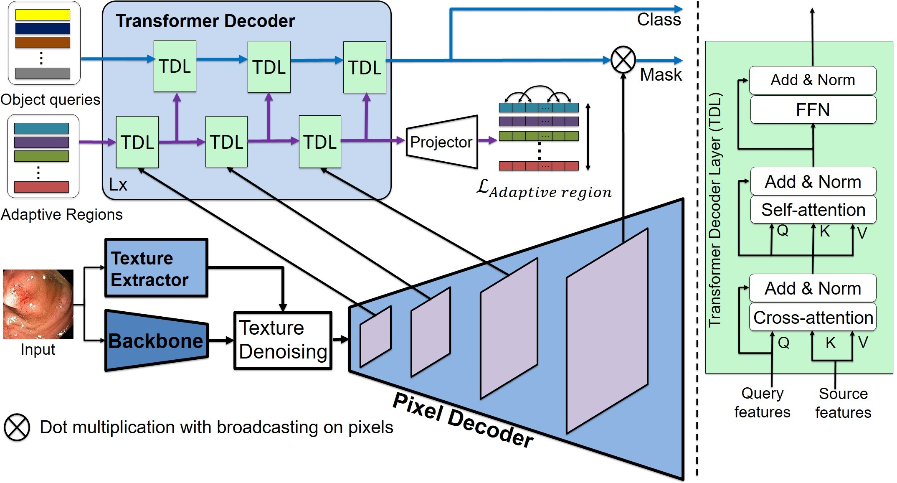

# PISeg
PISeg: Polyp Instance Segmentation With Texture Denoising And Adaptive Region

##  Introduction

This repository contains the PyTorch implementation of PISeg, Polyp Instance Segmentation With Texture Denoising And Adaptive Region. 
Our proposed PISeg has three modules: a Backbone, a Pixel Decoder, and a Transformer Decoder, as shown in the figure below. First, the backbone handles feature extraction of the input endoscopic image. Besides, the texture image is also extracted by a Texture extractor and used to reduce texture noise in the image feature. Next, the Pixel Decoder upsamples image features into high-resolution features, which are then used by the Transformer Decoder module (TDM) to query polyp instances. A set of Adaptive region queries is responsible for detecting regions containing polyp signs from received feature maps. These region queries are learned through Transformer decoder layers (TDL) and are guaranteed to be independent of each other by a Region loss function. Besides, a set of object queries will be synthesized based on adaptive regions to generate object embeddings for classifying and segmenting polyps.



##  Install dependencies

Dependent libraries
* torch
* torchvision 
* opencv
* ninja
* fvcore
* iopath

Install detectron2 and PISeg.

```bask
# Under your working directory
# Install Detectron2
cd ./detectron2
!python setup.py build develop
cd ..

#Install requirements for piseg
cd ./piseg
!pip install -r requirements.txt
cd ..

cd ./piseg/piseg/modeling/pixel_decoder/ops
!sh make.sh


```

##  Polyp instance segmentation dataset
[Kvasir-SEG](<https://datasets.simula.no/kvasir-seg/>) is the most commonly used benchmark of polyps segmentation captured from real-world environments. However, the dataset and others only provide binary semantic masks labeling image regions as polyp or non-polyp. In this work, we take further steps to propose an annotated dataset for pedunculated and sessile polyp instance segmentation. Specifically, we leverage 1,000 polyp images from the Kvasir-SEG dataset, separate the provided polyp semantics into distinguished instances of the two classes, and annotate its masks. 


##  Usage

####  1. Training


####  2. Inference


##  Acknowledgement

Part of the code was adpated from [Mask2Former: Masked-attention Mask Transformer for Universal Image Segmentation](<https://github.com/facebookresearch/Mask2Former>)

```bash
@INPROCEEDINGS{9878483,
  author={Cheng, Bowen and Misra, Ishan and Schwing, Alexander G. and Kirillov, Alexander and Girdhar, Rohit},
  booktitle={2022 IEEE/CVF Conference on Computer Vision and Pattern Recognition (CVPR)}, 
  title={Masked-attention Mask Transformer for Universal Image Segmentation}, 
  year={2022},
  volume={},
  number={},
  pages={1280-1289},
  keywords={Image segmentation;Shape;Computational modeling;Semantics;Computer architecture;Transformers;Feature extraction;Segmentation;grouping and shape analysis; Recognition: detection;categorization;retrieval},
  doi={10.1109/CVPR52688.2022.00135}
}
```
